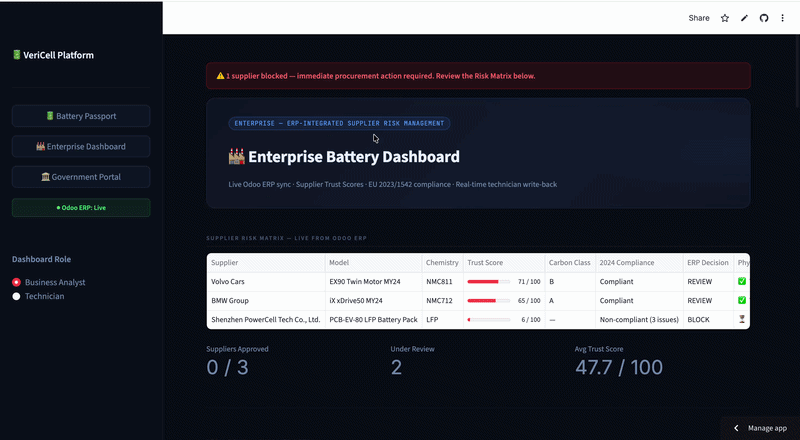
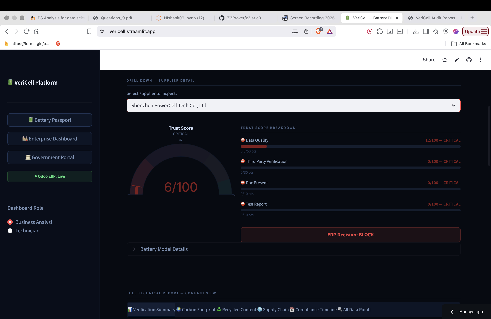
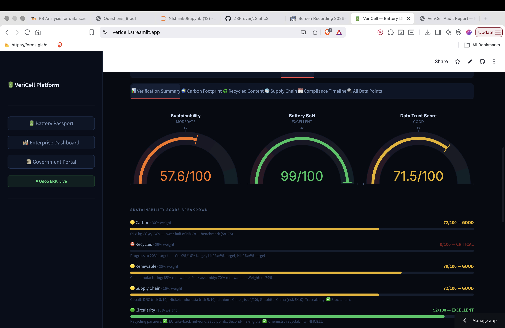
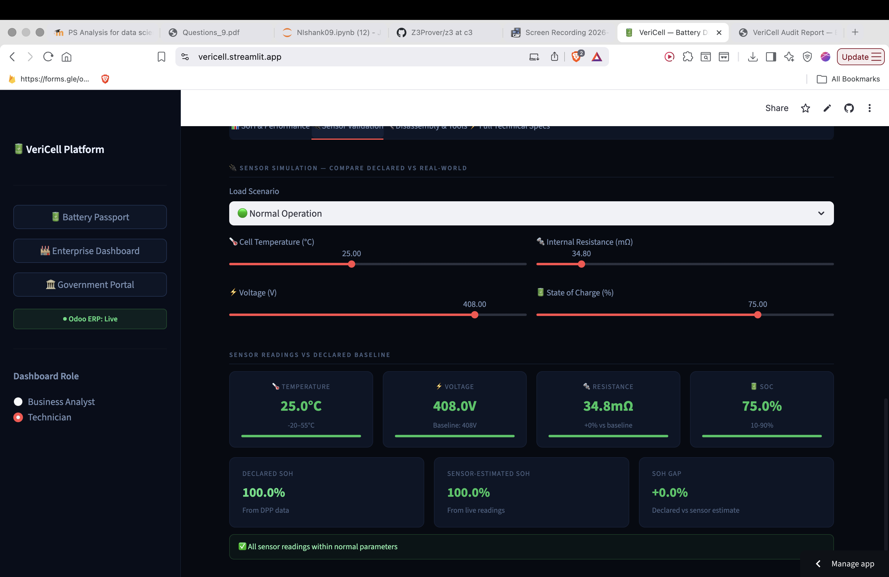

# VeriCell — EU Battery DPP Trust & Fraud Detection Engine

<<<<<<< HEAD
> **One-line pitch:** AI-powered trust validation for EV battery data — turning unverified Digital Product Passports into actionable procurement, compliance, and reuse decisions, synced live to ERP systems.
---
# BRIEF
The EU Battery Regulation mandates a Digital Product 
Passport for every battery by 2027.

Every company is rushing to collect and log that data.

Nobody is checking if it's true.

A manufacturer can declare "Class A" carbon footprint 
while their actual numbers put them in Class C. The 
DPP logs it. Nobody catches it.

This matters because the second-life EV battery market 
— batteries repurposed after their first automotive 
life — is worth billions. But right now it barely 
functions. Why? Because buyers can't trust the data. 
A battery declared at 80% health might be at 60%. 
There's no verification layer.

We built one.

VeriCell runs 8 mathematical cross-checks on every 
battery's declared data — catching internal 
contradictions that only show up when you do the 
math. Energy consistency, carbon class matching, 
cobalt weight plausibility. Things a fraudulent 
or lazy submission can't survive.

Then we push the decision — APPROVE, REVIEW, or 
BLOCK — directly into the buyer's ERP system.

Not a report. A decision. In real time.

Built in 72 hours at a hackathon.
=======
> **Built in 72 hours at ViennaUP Hackathon 2026** · 🏆 Europe Tech Hackathon

    
>>>>>>> 71b06ff (Rebuild README — visual demo, fraud detection, live app link)

---

## The Problem in One Sentence

Every company logs EU Battery Digital Product Passport data. **Nobody checks if it's true.**

A manufacturer can declare "Class A" carbon footprint while their actual numbers put them in Class C. The DPP logs it. Nobody catches it. The result: a **€1–3 billion second-life battery market** that barely functions because buyers can't trust the data — so batteries worth €5,000–15,000 each get destroyed instead of reused.

**VeriCell is the trust layer that fixes this.**

---

## Demo







**[→ Open Live App](https://vericell.streamlit.app/)**

---

## What VeriCell Does

```
Manufacturer submits battery JSON (102 data points, EU DPP format)
                          ↓
         VERICELL TRUST ENGINE — 6 modules
    ┌─────────────────────────────────────┐
    │  1. Sustainability Scorer           │
    │  2. Authenticity Checker  ← FRAUD  │  ← 8 math cross-checks
    │  3. Compliance Tracker              │  ← 2024/2027/2031/2036
    │  4. Sensor Validator                │
    │  5. Trust Score Calculator          │
    │  6. SoH Composite                   │
    └─────────────────────────────────────┘
                          ↓
         APPROVE (>85) / REVIEW (65–85) / BLOCK (<65)
                          ↓
         Live Odoo ERP — decision synced in real time
```

**The engine is deterministic** — same input always produces same output. No black box. Every decision is explainable with a formula.

---

## The Fraud Detection Layer (Why This Is Different)

Standard DPP platforms store data. VeriCell runs **8 mathematical cross-field checks** that catch what storage can't:

| # | Check | What It Catches |
|---|---|---|
| 1 | Energy Consistency | `Voltage × Capacity / 1000 ≠ declared kWh` → manipulation |
| 2 | Cell Count | `Modules × Cells per module ≠ Total` → structural lie |
| 3 | Carbon vs Benchmark | Declared CO₂ outside chemistry range → fake green claims |
| 4 | Carbon Class Match | Declares "Class A" but numbers say "Class C" → label fraud |
| 5 | Cobalt Weight Plausibility | Mass × cathode fraction doesn't add up → material fraud |
| 6 | EU DoC Completeness | Missing reference + notified body → Art. 18 violation |
| 7 | Supply Chain Traceability | No OECD framework + no verifier → unverifiable sourcing |
| 8 | **Trust Score Ceiling** | `max_trust = (real_data_pct × 0.5) + 50` → **can't game the score** |

Check #8 is the key anti-gaming mechanism: if 0% of your data is independently verified, your trust score cannot exceed 50/100 — which automatically lands you in BLOCK.

---

## Key Stats

| Metric | Value |
|---|---|
| Data points validated per battery | **102** |
| EU regulation groups covered | **13 (A–M)** |
| Fraud detection checks | **8 mathematical cross-checks** |
| Compliance milestone years | **4 (2024 / 2027 / 2031 / 2036)** |
| User roles with access control | **4 (Consumer / Technician / Business / Regulator)** |
| ERP integration | **Live Odoo XML-RPC** |
| Build time | **72 hours** |

---

## The 3 Demo Batteries

| Battery | Trust Score | Decision | Authenticity | Why |
|---|---|---|---|---|
| Volvo EX90 NMC811 | 71.5/100 | 🟡 REVIEW | 8/8 checks | 43% real data, 2031 AT RISK |
| BMW iX NMC712 | 65.5/100 | 🟡 REVIEW | 6/8 checks | 31% real data, 2 auth failures |
| Shenzhen LFP | **6.0/100** | 🔴 **BLOCK** | 2/5 checks | 0% real data, no EU DoC, no CE mark |

The Generic OEM case is the "caught fraud" demo — triggers the red BLOCK banner in the Enterprise Dashboard and auto-syncs the BLOCK decision to Odoo ERP.

---

## 4 Role-Based Views

The same engine output, presented differently for each stakeholder:

**Consumer (L1)** — Trust badge + QR code + plain-language health summary + recycling info

**Technician (L2)** — Live sensor sliders (temperature, voltage, resistance, SoC) with real-time anomaly detection + full SoH breakdown + Odoo sync button

**Business Analyst (L3)** — Sustainability scoring (5 components) + supply chain risk table + compliance timeline + all 102 data points filterable

**Regulator (L4)** — AI Audit Summary + full 8-check authenticity audit with formulas + unredacted 102-point table + downloadable HTML audit report

---

## Live ERP Integration

```python
# Real XML-RPC connection — not mocked
import xmlrpc.client

# push_verification_result() writes to live Odoo product record:
# "Volvo EX90 | Trust Score: 71.5/100 | REVIEW | VeriCell DPP"

# push_status_update() writes technician operational status:
# "Operational / Under Review / Flagged / Decommissioned"
```

**Live instance:** `https://vericell.odoo.com`

The Odoo integration is an adapter layer — the verification output is standard JSON. Replacing Odoo with SAP, Microsoft Dynamics, or weclapp is a configuration swap, not an engineering rebuild.

---

## Business Model

**We sell the trust layer, not the ERP.**

| Revenue Stream | Customer | Pricing |
|---|---|---|
| Per-passport validation | Second-life operators (Voltfang, Cylib) | €30–80 per battery |
| SaaS dashboard | Fleet operators, recyclers | €1,500–5,000/month |
| Compliance API | ERP vendors (SAP, Odoo, weclapp partners) | €50,000–200,000/year |
| Insurance data feed | Allianz, battery leasing companies | €100,000–500,000/year |

**First customer target:** Second-life battery operators who cannot repurpose batteries without trusted SoH data. At 1,000 batteries/month: **€30K–80K MRR from one customer.**

**The AVILOO analogy:** AVILOO gave used EV dealers a trusted certificate — dealers pay a premium for AVILOO-certified cars. We are AVILOO for B2B battery procurement data.

---

## Competitive Position

| Company | What They Do | Our Difference |
|---|---|---|
| Minespider | Blockchain supply chain storage | They store data. We validate it. |
| Circulor | Supply chain traceability | No cross-field validation or ERP action |
| Spherity | DPP digital identity | Identity layer only — no trust scoring |
| Circularise | DPP data management | No procurement decision integration |
| AVILOO | Consumer EV battery certificates | Consumer/dealer only. We do B2B procurement. |

**The gap nobody fills:** Data exists → validated across 102 points → APPROVE/REVIEW/BLOCK decision → synced to procurement ERP in real time. That full chain. That's VeriCell.

---

## Tech Stack

| Layer | Technology |
|---|---|
| UI | Streamlit 1.32+ |
| Charts | Plotly 5.18+ (gauges, bar charts, choropleth maps) |
| Data | Pandas 2.0+ |
| ERP | xmlrpc.client (Python stdlib — no external dependency) |
| QR | qrcode[pil] 7.4+ |
| Engine | Pure Python — deterministic, no ML frameworks |
| Storage | JSON (EU DPP standard format) |
| Secrets | Streamlit secrets.toml |

---

## Quick Start

```bash
pip install streamlit plotly pandas "qrcode[pil]"
cd battery-dpp
streamlit run app.py
```

Default landing: **Enterprise Dashboard** — opens directly on the BLOCK alert for Generic OEM.

Odoo credentials in `.streamlit/secrets.toml`. App runs offline from Odoo gracefully if credentials unavailable.

---

## Architecture Deep Dive

For full technical documentation including all 6 engine modules, the 102 data points across 13 groups, the Trust Score formula, Physical Sensor Verification levels, and the EU regulation compliance timeline — see [TECHNICAL.md](TECHNICAL.md).

---

## About

Built by **Nishank Yadav** at ViennaUP Hackathon 2026 — product ideation and refinement through constant iteration with the team, mentors, and domain experts over 72 hours.

**[github.com/nishankvie](https://github.com/nishankvie)** · **[linkedin.com/in/nishankvie](https://linkedin.com/in/nishankvie)**
